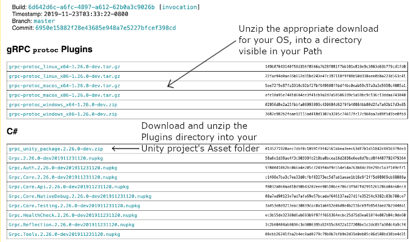
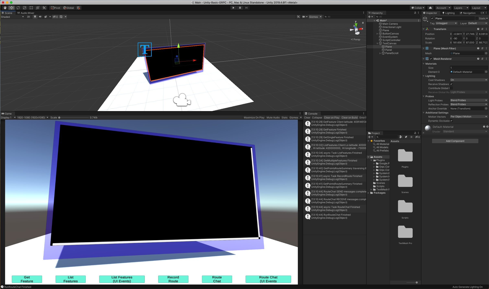

# Unity Basic gRPC

This Unity 2019.4 project is a simple learning project to integrate Unity3D visuals
with backend gRPC (**Google Protobuffers**) APIs. 

It is inspired from this [medium.com article](https://medium.com/@shadabambat1/basic-client-server-communication-using-unity-grpc-f4a3c2cf819c).

This project is not fundamentally different, but it provides as a Unity3D Client example to coincide 
with the [gRPC Basics tutorial](https://grpc.io/docs/languages/csharp/basics/), which defines a gRPC/Protobuf service
that covers [all of the gRPC service method calls](https://grpc.io/docs/what-is-grpc/core-concepts/):
1. Simple RPC
2. Client-side Streaming RPC
3. Server-side Streaming RPC
4. Bi-directional (Client and Server) Streaming RPC

The [gRPC Basics tutorial](https://grpc.io/docs/languages/csharp/basics/) contains information on cloning 
and setting up the core Routeguide service and is a pre-requisite for using this Unity3D example project.
The article also explains how to generate the gRPC client and server interfaces from the .proto service definition.

**Important:**

1. To use gRPC in Unity, you need plugins available in this [gRPC build archive](https://packages.grpc.io/archive/2019/11/6950e15882f28e43685e948a7e5227bfcef398cd-6d642d6c-a6fc-4897-a612-62b0a3c9026b/index.xml)
2. You'll need to install the matching protoc compile and it's plugins as well.

This Unity Basic GRPC project already has the protoc generated client classes in it's Assets/Scripts directory.
They were generated from the gRPC Basic tutorial code project's **.proto** file using this command:

<pre>
<code>
     protoc --csharp_out=routeguide --grcp_out=routeguide --plugin=protoc-gen-grcp={directory_your_grpc_csharp_plugin_is_installed}/1.26/grpc_csharp_plugin routeguide/route_guide.proto
</code>
</pre>

The Unity3D project contains (2) UIs, one is Screenspace Overlay, the other UI for presentation of RPC data is Worldspace.
The Screenspace Overlay Canvas has buttons that invoke the (4) example functionalities:
- GetFeature
- ListFeatures
- RecordRoute
- RouteChat

2 additional buttons (UI Events) pass bool values to specific RPC methods that request 
updates to the Scrollview TMP Text control as they are streamed back, instead of updating the
UI in one-shot. This is only to help visualize impacts of updating the UI as small amounts of data are individally
returned. 

Note: This project also makes use of the UnityMainThreadDispatcher.cs script from the github
 repository:
 https://github.com/PimDeWitte/UnityMainThreadDispatcher
 
It's use comes from the fact that Unity UI updates need to occur in the main rendering thread.
The gRPC service invocations run within Tasks, each performing their activity on a separate thread. The 
**UnityMainThreadDispatcher** assists in taking the separate thread RPC server output, and 
enqueuing it to run on the main UI thread. 

# To Run:

1. In a separate terminal or console window, start the grpc basic tutorial server 
2. Start the Unity3D editor and load the Unity Basic GRPC project
3. Locate the (ScriptController) gameobject in the hierarchy window and in the inspector, 
locate it's attached RouteGuideUIHandler script.
4. Adjust the IP and Port variables as necessary. 
5. Run the Unity app.  